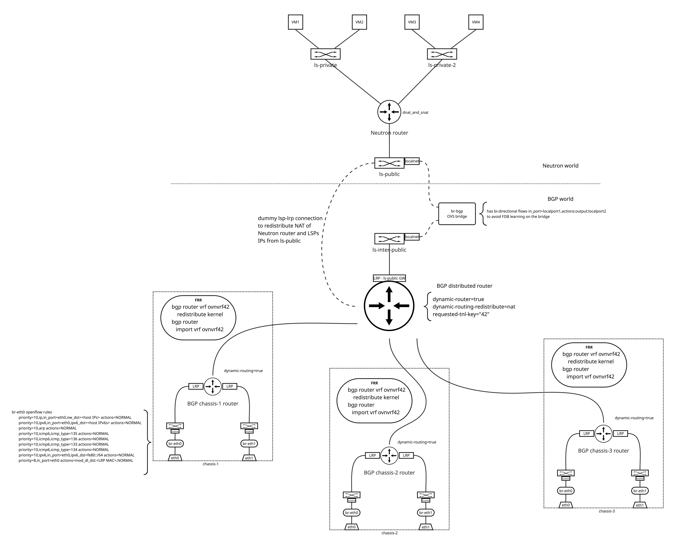

====================================
Core OVN BGP integration
====================================

https://bugs.launchpad.net/neutron/+bug/2111276

OVN 25.03 introduces BGP-related capabilities that provide parity with the
current ovn-bgp-agent underlay exposing method.
This spec is to introduce a design using the OVN capabilities integrated with
Neutron to replace the ovn-bgp-agent.

Problem Description
===================

The ovn-bgp-agent is another process running on compute and network nodes.
There is a lot of processing happening when new workloads are created or moved
around because the agent needs to pay attention to these changes and rewire
configuration on the node as needed. As OVN is well aware of the locality of its
resources we can leave all the processing up to OVN and only manage underlying
BGP OVN topology in Neutron and still use the pure L3 spine-and-leaf topology
for the dataplane traffic.

Acronyms used in this spec
==========================

- BGP: Border Gateway Protocol
- ECMP: Equal-Cost Multi-Path
- LRP: Logical Router Port
- LSP: Logical Switch Port
- LS: Logical Switch
- LR: Logical Router
- VRF: Virtual Routing and Forwarding
- FRR: Free Range Routing (https://github.com/FRRouting/frr)

Proposed Change
===============

This spec proposes to introduce a new Neutron service plugin that manages the
underlying BGP topology in OVN. Its main purpose is to make sure the OVN
resources related to BGP are correctly configured at all times by being a
reconciler over those resources. Additionally it takes care of scaling in and
out the compute nodes because every compute node needs to have their own bound
resources, such as a router and a logical switch with a localnet port.

There is no need to make any changes to API or database models. However, there
is a need to modify Neutron OVN DB sync scripts to not monitor the underlying
BGP resources. Possibly this was already planned to exist in Neutron with the
spec at [1]_ so we need to revive the work. That can be achieved by setting an
explicit tag in the external_ids column of the BGP managed resources that
Neutron would not touch.  Also, we need to make sure on the presentation layer
that all the underlying BGP resources are not exposed to the users through an
API. For example, a router list command must not return the BGP routers.

Each compute node requires a running FRR instance that monitors the local VRF
and advertises the routes to the BGP peers. It is the installer's responsibility
to configure the FRR instance to use the correct BGP parameters and to connect
to the correct BGP peers.

As it is easier to understand the topology visually than through description,
the following diagram shows the underlying BGP logical topology in OVN. For
better resolution, it is recommended to open the image in a new tab.

OVN BGP Logical Topology (click for full resolution)

BGP distributed logical router
------------------------------

A new router with the OVN BGP enabled capabilities is introduced, the router is
named "BGP distributed router" in the diagram above, with dynamic routing flag
enabled. The router is connected to the provider logical switch with a dummy
connection. This connection is not used for any traffic and serves only to
logically connect the logical switch and the BGP router so the northd can create
entries in the Advertised_Route table in the Southbound DB for the IPs that need
to be advertised.

The router also connects to a LS with a localnet port. This LS is connected to
the provider bridge br-bgp that needs to be configured on every chassis since
the traffic here is distributed and can happen on any node. This bridge connects
to the ls-public LS through the localnet port created by Neutron. This LS is
what typically connects the physical network in the traditional deployments. We
need to have localnet ports to avoid OVN sending traffic over the geneve tunnel
to the node hosting the logical router gateway.

The BGP distributed router is connected to the per-chassis logical routers
through peered LRPs and bound to the corresponding chassis. The LRs per chassis
are described in the next section. Because the BGP router is distributed we need
to pick the right LRP so the traffic is not forwarded to a different chassis.
For example, if there is egress traffic coming from a tenant LSP on chassis A,
the BGP distributed router needs to route the traffic to the LRP on chassis A.
For this we will use logical routing policy and the is_chassis_resident match.
An example of the logical routing policy is shown below:

.. code-block:: text

  action              : reroute
  bfd_sessions        : []
  chain               : []
  external_ids        : {}
  jump_chain          : []
  match               : "inport==\"lrp-bgp-main-router-to-ls-interconnect\" && is_chassis_resident(\"cr-lrp-bgp-main-router-to-bgp-router-r0-compute-0\")"
  nexthop             : []
  nexthops            : ["169.254.0.1"]
  options             : {}
  priority            : 10

The nexthop in this case is the LRP on the chassis A and for now must be an IPv4
as OVN currently contains a bug that prevents the use of IPv6 LLAs as nexthops,
reported at [2]_.  The policy is implemented only on the chassis defined in
is_chassis_resident and hence the traffic will always remain local to the
chassis. Because the policy is at a later stage in the LR pipeline we need to
create a logical router static route in order to pass the routing phase. Hence
the BGP distributed logical router needs to contain two static routes. One to
route ingress traffic to the provider network and one unused route that serves
only to pass the routing stage in the pipeline until the reroute policy is hit.

The first static route can look like this:

.. code-block:: text

  bfd                 : []
  external_ids        : {}
  ip_prefix           : "192.168.111.0/24"
  nexthop             : "192.168.111.30"
  options             : {}
  output_port         : lrp-bgp-main-router-to-ls-interconnect
  policy              : []
  route_table         : ""
  selection_fields    : []

where the ip_prefix is the provider network prefix and the output_port is the
LRP connecting to the provider LS. The nexthop is the LRP of the Neutron router
port that serves as a gateway.

The second static route is unused and can look like this:

.. _fake-static-route:

.. code-block:: text

  bfd                 : []
  external_ids        : {}
  ip_prefix           : "0.0.0.0/0"
  nexthop             : "192.168.111.30"
  options             : {}
  output_port         : []
  policy              : []
  route_table         : ""
  selection_fields    : []

The route needs to match all traffic and the nexthop doesn't matter because it
will be determined by the reroute policies based on the chassis locality. The
ingress logical router pipeline with the route implemented looks like this:

.. code-block:: text

  ... the other routes are here but none matches 0.0.0.0/0 ...
  table=15(lr_in_ip_routing   ), priority=4    , match=(reg7 == 0 && ip4.dst == 0.0.0.0/0), action=(ip.ttl--; reg8[0..15] = 0; reg0 = 192.168.111.30; reg5 = 192.168.111.30; eth.src = 00:de:ad:10:00:00; outport = "lrp-bgp-main-router-to-ls-interconnect"; flags.loopback = 1; reg9[9] = 1; next;)
  table=15(lr_in_ip_routing   ), priority=0    , match=(1), action=(drop;)
  table=16(lr_in_ip_routing_ecmp), priority=150  , match=(reg8[0..15] == 0), action=(next;)
  table=16(lr_in_ip_routing_ecmp), priority=0    , match=(1), action=(drop;)
  table=17(lr_in_policy       ), priority=10   , match=(inport=="lrp-bgp-main-router-to-ls-interconnect" && is_chassis_resident("cr-lrp-bgp-main-router-to-bgp-router-r0-compute-0")), action=(reg0 = 169.254.0.1; reg5 = 169.254.0.2; eth.src = 00:de:ad:00:10:00; outport = "lrp-bgp-main-router-to-bgp-router-r0-compute-0"; flags.loopback = 1; reg8[0..15] = 0; reg9[9] = 1; next;)

As we need to get to the stage where the reroute policy is hit, we need to pass
the lr_in_ip_routing stage first and this stage is implemented with a static
route. That means we match the 0.0.0.0/0 prefix using the first rule and then
later we change the output_port with the last rule with its reroute action. If
the static route would not be present, the traffic would be dropped with the
second rule containing the drop action.

Per-chassis logical routers
---------------------------

There is also a logical router created and bound to each chassis. These routers
serve to learn ECMP routes from the BGP peers and to forward traffic between the
provider bridges and the BGP distributed router.

For cases where the compute nodes share data plane and control plane traffic
over the same spine-and-leaf topology, there is a need to maintain openflow
rules on the provider bridge that differentiate traffic between control plane,
and hence forward traffic to the host, and the dataplane traffic that needs to
go to the OVN overlay. The following openflow rules could be used to achieve
this:

.. _openflow-rules:

.. code-block:: text

  priority=10,ip,in_port=eth0,nw_dst=<host IPs> actions=NORMAL
  priority=10,ipv6,in_port=eth0,ipv6_dst=<host IPv6s> actions=NORMAL
  priority=10,arp actions=NORMAL
  priority=10,icmp6,icmp_type=133 actions=NORMAL
  priority=10,icmp6,icmp_type=134 actions=NORMAL
  priority=10,icmp6,icmp_type=135 actions=NORMAL
  priority=10,icmp6,icmp_type=136 actions=NORMAL
  priority=10,ipv6,in_port=eth0,ipv6_dst=fe80::/64 actions=NORMAL
  priority=8,in_port=eth0 actions=mod_dl_dst:<LRP MAC>,output:<patch_port_to_ovn>

Those rules match traffic that is destined to the host and forward it to the
host. Everything else is forwarded to the OVN overlay. The patch_port_to_ovn is
a patch port that ovn-controller created based on the ovn-bridge-mappings
configuration.

The router itself needs to implement routes for traffic coming from the provider
network and for traffic coming from the OVN overlay. For ingress provider
network traffic, the routes can look as follows:

.. code-block:: text

  bfd                 : []
  external_ids        : {}
  ip_prefix           : "192.168.111.0/24"
  nexthop             : "169.254.0.2"
  options             : {}
  output_port         : lrp-bgp-router-r0-compute-0-to-bgp-main-router
  policy              : []
  route_table         : ""
  selection_fields    : []

where ip_prefix matches the subnet of the provider network and the nexthop is
set to the address of the LRP attached to the BGP distributed router and the
output_port is set to its peer LRP.

The egress traffic from the OVN overlay needs to be routed with ECMP to the BGP
network. This can be achieved with the following static routes for each BGP
peer:

.. code-block:: text

  bfd                 : []
  external_ids        : {}
  ip_prefix           : "0.0.0.0/0"
  nexthop             : "100.64.0.1"
  options             : {}
  output_port         : lrp-bgp-router-r0-compute-0-to-ls-r0-compute-0-eth0
  policy              : []
  route_table         : ""
  selection_fields    : []

  bfd                 : []
  external_ids        : {}
  ip_prefix           : "0.0.0.0/0"
  nexthop             : "100.65.0.1"
  options             : {}
  output_port         : lrp-bgp-router-r0-compute-0-to-ls-r0-compute-0-eth1
  policy              : []
  route_table         : ""
  selection_fields    : []

Traffic flow
============

This section describes the traffic flow from and to a LSP hosted on a chassis.

An example of the traffic from the external network to a VM with a Floating IP on chassis 1
-------------------------------------------------------------------------------------------

Because of the dummy connection between the ls-public LS and the BGP distributed
router, OVN creates an Advertised_Route entry for the Floating IP.  Because the
associated logical port is bound to the chassis 1, OVN populates the local VRF
on the chassis 1 with the route to the Floating IP and the local FRR instance
advertises the route to the BGP peers.

The fabric learns the route to the Floating IP from the BGP peers and forwards
the traffic to the chassis 1 to either eth0 or eth1 because of the ECMP routes.

The traffic does not match any of the higher priority :ref:`openflow rules
<openflow-rules>` on the provider bridge and matches the last rule. The rule
changes the destination MAC to the LRP MAC address of the per-chassis router
associated with the NIC and the traffic is forwarded to OVN. The traffic enters
the per chassis logical router that has Logical_Static_Route configured to
forward the traffic to the distributed BGP router. The BGP distributed router is
configured to forward the traffic to the ls-inter-public switch with a
Logical_Static_Route matching the destination IP with the provider network
subnet and through the br-bgp provider bridge the traffic gets to the ls-public
logical switch. From here the traffic follows the same path as without BGP and
is NAT'ed by the Neutron router.

An example of the traffic from a VM with a Floating IP on chassis 1 to the external network
-------------------------------------------------------------------------------------------

The egress VM traffic is NAT'ed by the Neutron router and the traffic is
forwarded to the provider network gateway which is connected to the ls-public
LS. Because of the presence of the localnet ports the traffic gets through the
br-bgp bridge to the distributed BGP router where it matches the artificial
:ref:`Logical_Router_Static_Route <fake-static-route>` to skip the
lr_in_ip_routing stage in the pipeline and will be matched with the BGP router
policy based on the chassis locality. The reroute action of the policy will pick
the right LRP that is connected to the per-chassis router. Here the traffic
matches static routes per peer and with the ECMP is
forwarded to the BGP networks.

Testing
=======

Existing tempest tests should provide good regression testing. We can reuse the
existing topology from the ovn-bgp-agent project that peer with VMs simulating a
BGP router.

Implementation
==============

The implementation is split into two parts. The first part creates the service
plugin that takes care of the BGP topology in OVN including the configuration of
static routes and router policies.

The second part is an OVN agent extension [3]_ that configures per chassis host
configurations. The OVN agent itself is orthogonal to the BGP service plugin and
can be replaced with any third-party tool that takes care of the node dynamic
configuration. The OVN agent extension is responsible for steering the traffic
to the OVN and for configuring the per chassis host configurations such as
adding ovn-bridge-mappings per the BGP peer, and for implementing local openflow
rules to differentiate traffic between the control plane and the dataplane. It
also monitors patch ports on the br-bgp and creates direct connection between
the localnet ports to avoid any FDB learning on the bridge.
An example of the simple openflow rules is shown below:

.. code-block:: text

  priority=10,in_port=2, actions=output:3
  priority=10,in_port=3, actions=output:2

where 2 is the patch port to the logical switch connected to the BGP distributed
router and 3 is the patch port connected to the Neutron public switch.

Where BGP is used with Neutron or not is determined by enabling the service
plugin and the OVN agent extension.

As it is written in the first paragraph of this spec, the BGP support in OVN
was introduced in 25.03. Therefore the BGP service plugin requires OVN 25.03 or
later.

Assignee(s)
-----------

* Jakub Libosvar <jlibosva@redhat.com>

Documentation
=============

Deployment guide will be written in describing how to enable the service plugin
and what needs to be configured on the nodes, such as steering traffic to the
OVN or configuration of a BGP speaker advertising the routes to its peer. An
example using FRR configuration will be introduced so the operators have a
reference for the configuration.

.. [1] https://review.opendev.org/c/openstack/neutron-specs/+/891204
.. [2] https://issues.redhat.com/browse/FDP-1554
.. [3] https://opendev.org/openstack/neutron/src/commit/1e6381cbd25f8ab4fc9a3bcaa1ab7af1d605946e/doc/source/ovn/ovn_agent.rst
