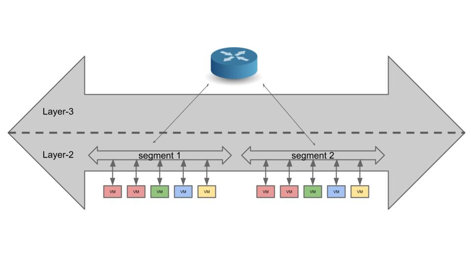
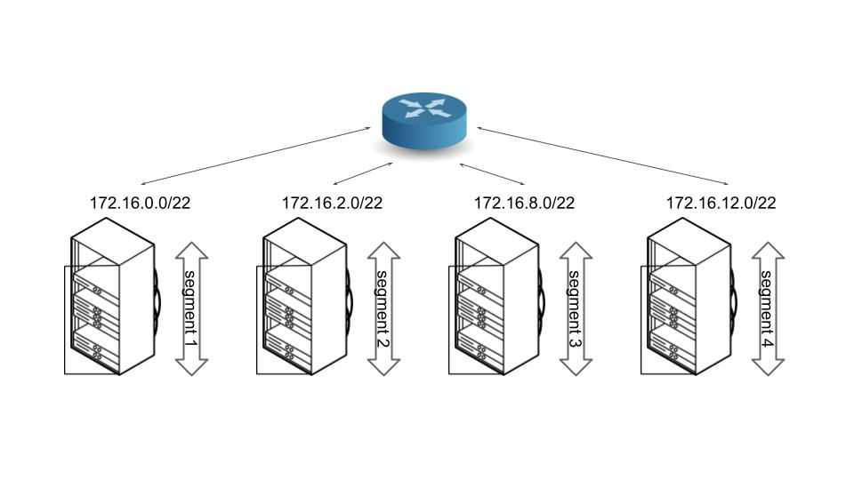
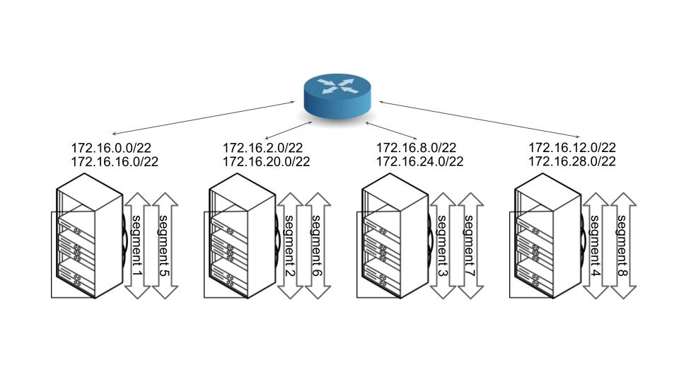
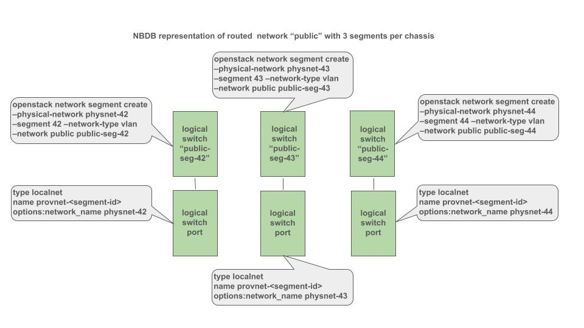
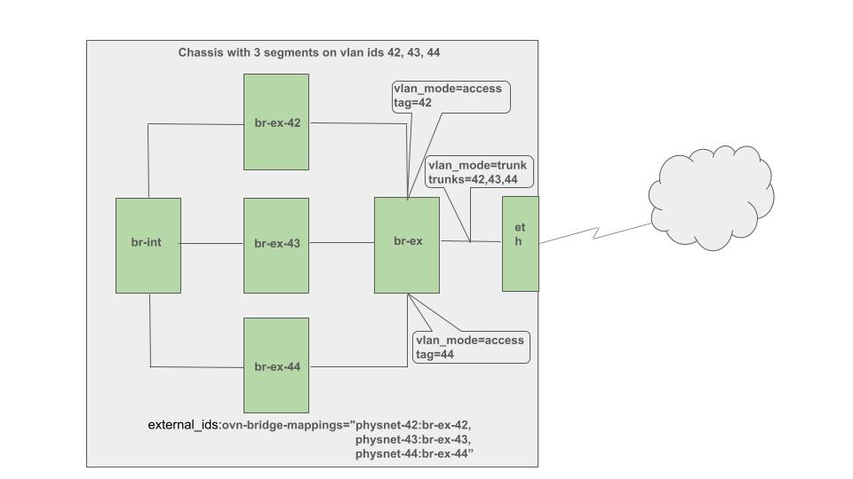

..
 This work is licensed under a Creative Commons Attribution 3.0 Unported
 License.

 http://creativecommons.org/licenses/by/3.0/legalcode

====================================================================
Routed Provider Networks with Multiple Segments per Host for ML2/OVN
====================================================================

https://bugs.launchpad.net/neutron/+bug/2130453

As implemented by the ML2/OVN driver, routed provider networks are limited to
one segment per host [1]_ [2]_. This specification proposes to remove such
limitation, enabling multiple segments per host per network.

Problem Description
===================

Originally, all Neutron networks were single L2 broadcast domains. In such
networks, performance degrades as traffic grows as a result of an increasing
number of active VMs/ports. Routed provider networks were implemented to
overcome this limitation and enable users to create "large networks", where a
large number of VMs/ports can be connected without incuring the performance
penalty of large single L2 broadcast domains. As shown in the following
diagram, routed provider networks are constituted by several L2 segments
(broadcast domains) stitched together by a router into one L3 "large network".
In this arrangement, each individual segment handles only a portion of the
total network traffic, improving overall performance. The router is not part
of Neutron; it is provided by the underlying networking infrastructure [3]_.

In routed provider networks each segment is connected to a group of hosts (a
Nova aggregate), as shown in the following diagram. In the optimal situation,
the network traffic generated by the workload running in the hosts doesn't
exceed the capacity of the corresponding segment.

Recently, though, some operators have found this not to be the case. They can
comfortably accomodate in the hosts workloads that generate network traffic
that exceeds their segment capacity. In such situations, more than one segment
per host is necessary if the deployers are going to fully utilize their compute
resources, while at the same time achieving the benefits of the routed provider
networks, by effectively limiting the size of the individual L2 broadcast
domains. This is shown in the following diagram.

Proposed Change
===============

This specification proposes to implement each segment in a routed provider
network as an OVN Logical Switch. Each one of these logical switches will be
associated with a Logical Switch Port of type localnet, that will map the
segment to a physical network in the hosts connected to it. As a consequence,
for routed provider networks, the one-to-one mapping between a Neutron network
and an OVN Logical Switch will no longer be true. The following diagram
summarizes the proposed approach, using a Neutron network named `public` and
segments with `vlan-ids` 42, 43 and 44 as examples:

At the chassis level, this design will be implemented as depicted in the
following diagram:

In this diagram, the key features of the proposed design are:

#. The four bridges `br-ex*` represent the routed provider network named
   `public` depicted in the previous diagram with its three segments.
#. Each of the bridges `br-ex-42`, `br-ex-43` and `br-ex-44` represents one of
   the segments in the routed provider network.
#. For each segment, there will be a key-value pair in OVS's
   `external_ids:ovn-bridge-mappings`. In the `public` network example we are
   using in this specification, for the physnet identified as `physnet-43`, the
   corresponding mapping is `physnet-43:br-ex-43`. It is the presence of these
   mappings that triggers the `ovn-controller` to configure the patch ports on
   the `br-int` side of the segment bridges. It is important to note that
   `br-ex` is not part of `external_ids:ovn-bridge-mappings`. The
   `ovn-controller` doesn't interact with that bridge.
#. There are two alternatives for the creation of the `br-ex*` bridges and the
   configuration of the `br-ex` side of the patch ports. They can be created
   automatically by Neutron or they can be created as a result of system
   administration activities. To select from these two alternatives, a large
   user of routed provider networks with the ML2/OVS driver was asked how
   frequently they have added segments to their hosts. They responded that they
   add segments every month. Based on this information, this specification
   proposes to develop an agent that will create bridges and configure them. It
   is important to note that since `br-ex` provides connectivity to the
   underlay network, it will still be created by the cloud
   operator.

To implement the proposed new functionality, the following changes to the code
are expected:

#. When a segment is created for a routed provider network, an associated
   Logical Switch and Logical Switch Port of type `localnet` will need to be
   created in the OVN NBDB. Correspondingly, these OVN resources will have to
   be removed when the segment is deleted.
#. When a port is created for a routed provider network, the creation of the
   associated Logical Switch Port will have to be deferred until the moment
   when the segment to which it is bound is known. Correspondingly, when a port
   is deleted, its associated Logical Switch Port will have to be removed from
   the correct Logical Switch.
#. The OVN maintenance and DB synchronization periodic jobs must be updated to
   account for the changes described in the previous two points.
#. For routed provider networks, the logical switch associated to each segment
   will have its own localport to serve metadata to VMs. This means that the
   metadata agent will be updated to provision the datapath in each chassis for
   localports associated to segments.
#. A `neutron-ovn-agent` extension will be developed that will be responsible
   for creating and configuring the bridges that represent the routed provider
   network segments at the chassis level. When a segment is added, the
   extension will add the corresponding bridge and add it to the OVS
   OpenvSwitch table `ovn-bridge-mappings` attribute. Patch ports will be
   created between the new bridge and `br-int` and `br-ex`. The `br-ex` side of
   the patch port will be configured with the correct `tag` and `trunk`
   attributes. When a segment is removed, these steps will be undone.

The implementation will be carried out in two phases. In the first phase, the
core functionality described in the first four points above will be
implemented. In the second phase, the `neutron-ovn-agent` extension to manage
the segment bridges at the chassis level will be developed. This approach will
allow us to start testing the core funcionality as soon as possible while
giving us more time to develop the `neutron-ovn-agent` extension.

References
==========

.. [1] https://bugs.launchpad.net/neutron/+bug/1865889
.. [2] https://docs.openstack.org/neutron/latest/admin/ovn/routed_provider_networks.html
.. [3] https://docs.openstack.org/neutron/latest/admin/config-routed-networks.html
