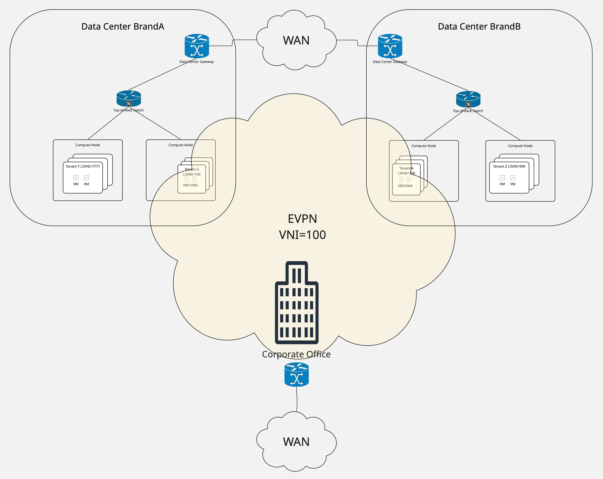
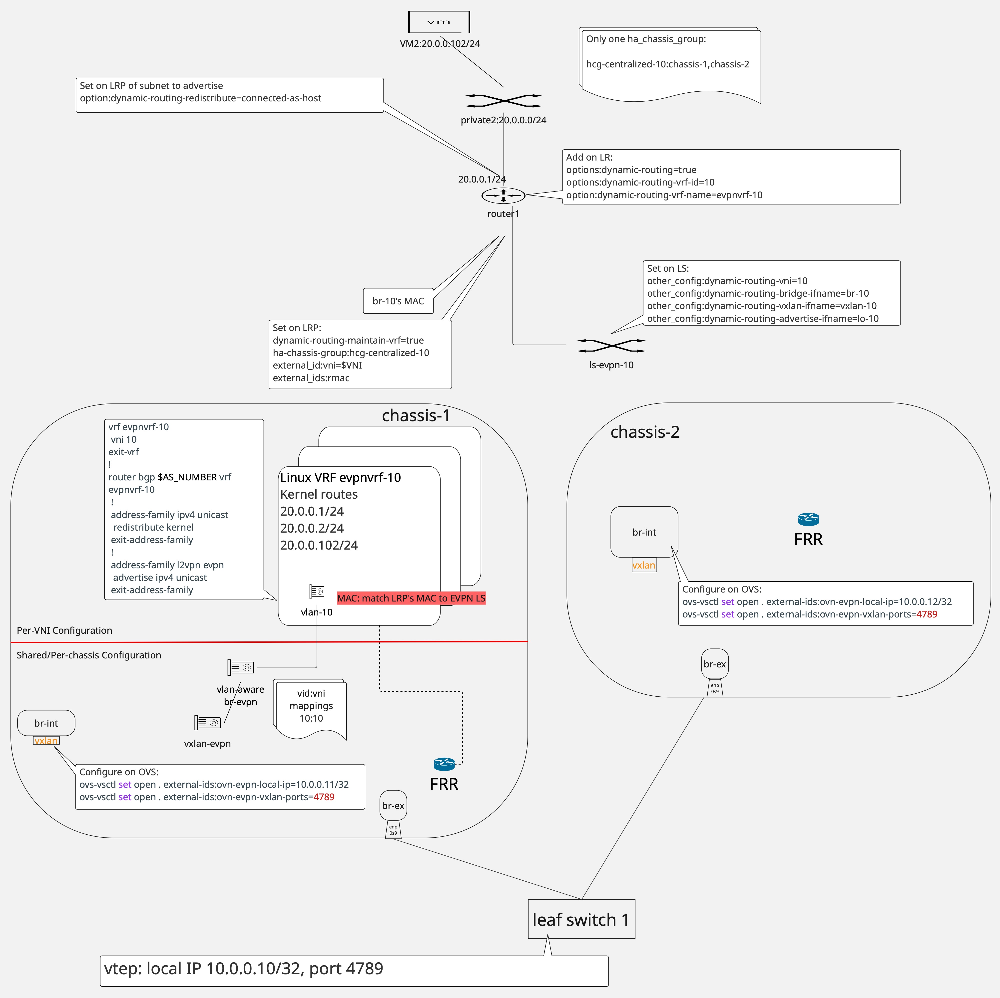
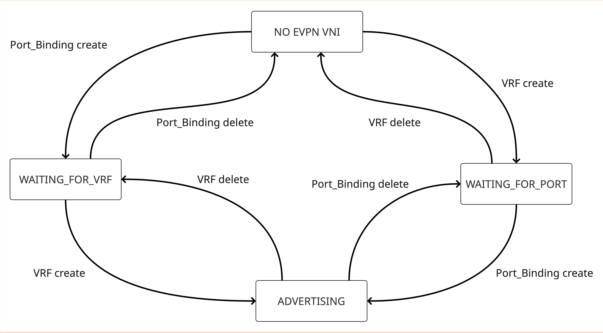
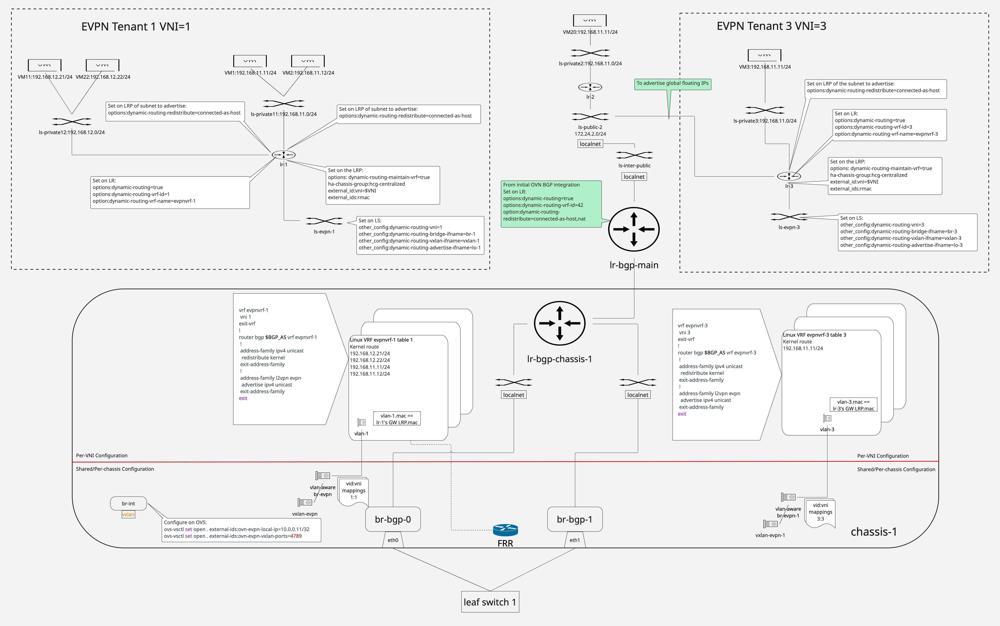

========================================================
Neutron to Provision BGP EVPN Type-5 Route Advertisement
========================================================

https://bugs.launchpad.net/bugs/2144617

OVN 26.03 extends its BGP-related capability to support advertisement of BGP
EVPN Type-5 routes.  This spec adds a new EVPN Service Plugin and OVN Agent
EVPN Extension to provision OVN, FRR, and Linux to realize EVPN Type-5 route
advertisement on OpenStack.

Problem Description
===================

Ethernet Private Virtual Network (EVPN) is a unified control plane technology
to support network management at data center scale [1]_.  Equally important,
EVPN as a standard protocol offers both flexible tenant traffic isolation and
the ability to create a single overlay network integrating all of a tenant's
distributed resources.  An enterprise might grow its network from a physical
corporate network to include tenant networks in more than one public data
center and further include a private data center, while at the same time
desire to present these distributed networks and the resources within those
networks as a single corporate network.  With EVPN supported at the corporate
network, public data centers, and the private data center, the enterprise
uses an EVPN identifier to signal that these distributed networks constitute a
single corporate network.

OVN 26.03 introduces BGP EVPN Type-5 route advertisement [2]_ using FRR [5]_
routing protocol suite.  Specifically, OVN 26.03 has new settings on logical
router, logical switch, and logical router port such that, when the related
settings are used together, OVN adds the IP prefixes associated with the
logical topology into a Linux table.  When FRR BGP EVPN is enabled, BGP
receives these prefixes in the Linux table and advertises them as EVPN Type-5
routes.

Using OVN and FRR alone is not enough to deploy EVPN Type-5 route
advertisement on OpenStack.  It is necessary to add a new EVPN Service Plugin
to configure OVN with new options.  It is also necessary to add a new OVN
Agent EVPN Extension to prepare the Linux environment for FRR EVPN as well as
to enable EVPN in FRR on each compute/network node.

Acronyms used in this spec
==========================

- FRR: Free Range Routing (https://github.com/FRRouting/frr)
- BGP: Border Gateway Protocol
- VPN: Virtual Private Network
- EVPN: Ethernet VPN, first defined in RFC 7432 for IP/MPLS network and later
  updated in RFC 9135
  (https://datatracker.ietf.org/doc/html/rfc9135.html) and RFC 9136
  (https://datatracker.ietf.org/doc/html/rfc9136.html) for data center
  environments
- VRF: Virtual Routing and Forwarding, a virtual routing and forwarding domain
  that can span a wide area network.  Linux models this as a Linux route table
  and uses the term VRF synonymously with route table
- VNI: In this document, it is the 24-bit Virtual Network Identifier within
  the VxLAN header that identifies an EVPN and is frequently synonymous with
  the EVPN itself, i.e., a VNI is the EVPN identified by the VNI
- OVN: Open Virtual Network (https://www.ovn.org)
- LR: OVN Logical Router
- LS: OVN Logical Switch
- VxLAN: Virtual eXtensible Local Area Network
- VLAN: Virtual Local Area Network
- AS: Autonomous System
- MAC: In this document, it is Ethernet Medium Access Control
- FSM: Finite State Machine

Scope
=====

This spec discusses the feature EVPN Type-5 route advertisements for IPv4
prefixes in OpenStack, using centralized routing.  The design limits the
operating system to Linux and the routing protocol stack to FRR.  To reduce
the software footprint when EVPN is enabled but core BGP floating IP
advertisement feature is unnecessary, the spec proposes a new plugin, Neutron
EVPN Service Plugin, that parallels the existing Neutron BGP Service Plugin
[3]_, to support EVPN Type-5 route advertisements.  The spec also proposes a
new Neutron OVN agent EVPN Extension that parallels the existing OVN Agent BGP
Extenison [4]_.

Deployment Model
================

Figure 1 illustrates the deployment model this spec supports.  A tenant's
private network is distributed across different networks.  EVPN allows the
tenant's distributed private network to present as a seamless network.  Figure
1 depicts a tenant's private network distributed across two different data
centers, but the tenant's private network spanning a data center and a branch
network or any other network would work the same.

   Figure 1: The EVPN deployment model this spec assumes and supports.

Background
==========

This section documents a few concepts useful for understanding the design.
OVN 26.03 defines new settings.  Each setting is one part of the machinery
that together makes IP prefixes available to BGP to advertise EVPN Type-5
routes, as well as correctly processing packets to and from these IP prefixes.
Neutron's role is to leverage these new settings to create EVPNs.

A VxLAN [16]_ tunnel acts as a large virtual switch, where the VNI field in
the VxLAN header is analogous to a VLAN tag in a physical Ethernet switch,
both identifying an isolated local area network.  In the case of EVPN, the
VNI identifies an EVPN.  In this document, an EVPN is synonymous with a VNI.

OVN models an EVPN (or VNI) as an OVN logical switch assigned a VNI.  When
processing ingress packets from a VxLAN tunnel, OVN uses the VNI field in the
VxLAN header and outputs the decapsulated packet to the logical switch
identified by the VNI.

EVPN Type-5 routes combine two concepts: VNI and virtual routing and
forwarding domain.  An EVPN Type-5 route is associated with a VNI, i.e., it
is a private route within an EVPN.  EVPN Type-5 routes constitute the route
table of a virtual routing and forwarding domain.  In this spec, a virtual
routing and forwarding domain is represented as a Linux table.  Thus, an EVPN
Type-5 route's VNI is mapped to a Linux table ID.  OVN maps such a Linux table
to an OVN logical router assigned a VRF ID equal to Linux table ID.  At the
same time, OVN maps the VNI to an OVN logical switch assigned a VNI.  This
combination of related Linux table, OVN logical router, and OVN logical
switch results in the logical topology in the design below.

EVPN Service Plugin requires a BGP network, where each compute (and network)
node has BGP peerings with one or more leaf switches to advertise EVPN routes.
This proposal to support EVPN Type-5 route advertisements creates the BGP
peerings if none exist or reuses the same BGP peerings as those in the BGP
Service Plugin.

Configuration File
==================

The ML2/OVN agent configuration file on each compute host, ovn_agent.ini,
should include a new section called [ovn_evpn].  The new section contains the
BGP AS number and the child VxLAN's UDP port number that is different from
4789.

.. code:: text

   [ovn_evpn]
   bgp_as = 64999
   child_vxlan_port = 49152

The ML2/OVN plugin configuration file on the server, ml2_conf.ini, should
also include a new section called [evpn] with evpn_vni_auto_ranges specifying
the VNI ranges used for auto-assignment.  The default range is the entire
24-bit range, except the value 0.

.. code:: text

    [evpn]
    evpn_vni_auto_ranges = 1:16777215

Installation Requirements
=========================

OVN 26.03 is the first OVN release supporting EVPN Type-5 routes.  While it is
not required, this spec uses the Single VxLAN Device feature available in OVN
26.03.1.  Stable support of the Single VxLAN Device feature is observed in
FRR 10+.  Although the spec has been tested with OVS 3.7.0, the only
requirement on OVS is support for VxLAN.

Neutron installation must include creation of a VxLAN tunnel terminated at an
IP address of the host that is reachable globally.  A reasonable IP address
is the host's loopback address.  The VxLAN tunnel uses the default VxLAN UDP
port 4789.  The VxLAN tunnel is created as follows.

.. code:: text

    ovs-vsctl set open . external-ids:ovn-evpn-local-ip=$vtep_ip
    ovs-vsctl set open . external-ids:ovn-evpn-vxlan-ports=4789

The existing BGP Service Plugin installation includes provisioning of a BGP
speaker using FRR.  The BGP speaker configuration must be updated to enable
EVPN address family.

.. code::

    ! $bgp_as is configured in /etc/neutron/plugins/ml2/ovn_agent.ini
    ! This BGP router is not new and should already be part of FRR
    ! configuration, as part of the initial OVN BGP integration
    router bgp $bgp_as
     ! Enable EVPN address family
     address-family l2vpn evpn
      ! <PEER_INTFn> should already be part of the IPv4 unicast address family
      ! configuration that is not included in this snippet
      neighbor <PEER_INTF1> activate
      neighbor <PEER_INTF2> activate
      advertise-all-vni
      advertise-svi-ip
     exit-address-family
    exit

Proposed Changes
================

Neutron Design
--------------

The spec proposes a new EVPN Service Plugin and a new Neutron OVN Agent EVPN
Extension to use new settings in OVN 26.03 to create an EVPN and to provision
the compute and network nodes to advertise routes within the EVPN.  The
changes occur in three parts of Neutron code.

* Modifications to Neutron API and CLI to allow a user to create a Neutron
  router associated with an EVPN and to advertise Neutron subnet prefixes
  within the EVPN.
* Add EVPN Service Plugin to process the new configurations, storing
  necessary EVPN information and creating OVN logical topology for EVPN.
* Add Neutron OVN Agent EVPN Extension to provision each compute or network
  node, with necessary additions of Linux interfaces and FRR configuration.

Figure 2 provides an overview of the objects and configurations that Neutron
provisions to realize EVPN Type-5 advertisements.

   Figure 2: The logical topology Neutron provisions per virtual routing and
   forwarding domain.

Changes to CLI and REST API
---------------------------

Changes to Neutron router creation are necessary to associate Neutron router
with an EVPN identified by a VNI.  The VNI association occurs only at creation
time and cannot be changed once a Neutron router is created.

Neutron router creation CLI and REST API are updated to allow for creation of
a router associated with an EVPN identified by the VNI value.  There are two
versions of the command, one where Neutron auto-assigns a VNI from within the
evpn_vni_auto_ranges, and one where the command specifies a VNI from outside
the evpn_vni_auto_ranges.  In both cases, Neutron ensures that each router has
a unique VNI and informs the user if the requested VNI is invalid instead of
failing silently.  By default, both commands are restricted to the cloud
administrator.

New CLI options:

.. code-block:: text

    # User requests EVPN, Neutron auto-assigns VNI
    openstack router create --evpn-vni <router_name>

    # Admin specifies explicit VNI
    openstack router create --evpn-vni 10000 <router_name>

    # Show router VNI
    openstack router show <router_name> -c evpn-vni

REST API — auto-allocate VNI (admin): Must set evpn_vni to value 0 for
auto-assignment

.. code-block:: text

    POST /v2.0/routers
    {
        "router": {
            "name": "evpn-router",
            "evpn_vni": 0
        }
    }

REST API — explicit VNI (admin):

.. code-block:: text

    POST /v2.0/routers
    {
        "router": {
            "name": "evpn-router-10000",
            "evpn_vni": 10000
        }
    }

REST API — response (always contains resolved integer VNI or null):

.. code-block:: text

    GET /v2.0/routers/{router_id}
    {
        "router": {
            "name": "evpn-router-10000",
            "evpn_vni": 10000,
            ...
        }
    }

"openstack router add subnet" CLI and the corresponding REST API are also
updated to allow a user to add a subnet to a router and indicate that the
subnet's prefixes are to be advertised within the router's VNI.  Thus, this
operation is only valid if the router is an EVPN router.  Conversely, when a
Neutron subnet is added to a router without the new option, the subnet's
prefixes are not advertised in the EVPN.

New CLI option:

.. code-block:: text

    # Mark subnet for which the prefixes should be advertised as host routes
    openstack router add subnet --advertise-host <router_name> <subnet_name>

REST API — request:

.. code-block:: text

    PUT /v2.0/routers/{router_id}/add_router_interface
    {
        "subnet_id": "<subnet_id>",
        "advertise_host": true
    }

REST API — response:

.. code-block:: text

    PUT /v2.0/routers/{router_id}/add_router_interface
    {
        "subnet_id": "<subnet_id>",
        "advertise_host": true,
        ...
    }

EVPN Service Plugin maintains a model, either a new model or extended from an
existing model, to associate the router with a VNI.  The model should be
extensible to accommodate Type-2 EVPN routes in the future.  EVPN Service
Plugin also subscribes to router lifecycle events to process the evpn_vni and
advertise_host attributes.

EVPN Service Plugin
--------------------

The API extensions trigger EVPN Service Plugin to create an OVN logical
topology to support EVPN.  This EVPN logical topology includes the logical
switch representing the VNI, the IP prefixes to be advertised in the VNI, and
a logical router representing the Linux route table for this EVPN.

The command "openstack router create --evpn-vni [<VNI>]" creates a Neutron
router for the EVPN.  EVPN Service Plugin handles this Neutron router
differently from other Neutron routers.  EVPN Service Plugin does not connect
the OVN logical router corresponding to this Neutron router to the existing
lr-bgp-main.  Instead, EVPN Service Plugin adds dynamic routing options to this
logical router to enable EVPN.

The option dynamic-routing [6]_ is necessary to enable participation of
dynamic routing outside of OVN.  The dynamic routing is provided by FRR BGP in
this case.

The option dynamic-routing-vrf-id [7]_ associates an OVN logical router with a
Linux table with the ID specified by dynamic-routing-vrf-id.  Neutron sets
the dynamic-routing-vrf-id to the VNI value assigned during router creation
above.  In other words, Neutron takes a VNI value and turns it into a Linux
table ID.  It is convenient for debugging that VNI and table ID match.  It is
also safe to use the VNI as the table ID, since the VNI is a 24-bit integer
while Linux route table ID is a 32-bit integer.  Neutron exposes VNI
configuration rather than the Linux table ID configuration, because the VNI
is a VxLAN network-wide external value while Linux table ID is a value local
only to a Linux host.  When Neutron assigns a Neutron router a VNI, Neutron
ensures that Linux table IDs used by lr-bgp-main are not used and CLI helper
text should inform users of this restriction.  By default, the numbers
lr-bgp-main uses are 10 and 42.

The option dynamic-routing-vrf-name [9]_ is an optional setting to use a more
distinctive name as the name of the Linux table for better visualization
during debugging.  The code block below suggests a pattern for the VRF name
but the exact pattern of the VRF names is discussed in the section on Naming
Convention.

.. code-block:: text

    # Options to set on the logical router
    options:dynamic-routing=true
    options:dynamic-routing-vrf-id=$VNI
    options:dynamic-routing-vrf-name=evpnvrf-$VNI

EVPN Service Plugin automatically creates a dummy OVN logical switch,
ls-evpn-$VNI (name discussed in the section on Naming Convention), to
represent the VNI bridge domain, since VNI is a bridge domain and OVN uses a
logical switch to model a bridge domain.  ls-evpn-$VNI should be connected to
the Neutron router for the VNI.  ls-evpn-$VNI has the following
configurations: dynamic-routing-vni [11]_, dynamic-routing-bridge-ifname
[12]_ and dynamic-routing-vxlan-ifname [13]_.  The code block below includes
all the necessary configurations on the logical switch for OVN to create the
flow rules to process EVPN packets.  The configurations related to interface
names are discussed in the section about OVN Agent EVPN Extension.  Their
names are discussed in the section on Naming Convention.

.. code-block:: text

    # OVN-defined configurations to set on the dummy logical switch
    # ls-evpn-$VNI
    other_config:dynamic-routing-vni=$VNI
    other_config:dynamic-routing-bridge-ifname=vlan-$VNI
    other_config:dynamic-routing-vxlan-ifname=vxlan-evpn

EVPN Service Plugin also creates logical router port lrp-to-evpn-$VNI (naming
convention to-be-determined) to connect the logical router corresponding to
the VNI to ls-evpn-$VNI, and adds two external_ids to lrp-to-evpn-$VNI,
indicating to Neutron OVN Agent EVPN Extension that the logical router port's
MAC address is the router MAC address of the EVPN, identified by VNI.

.. code-block:: text

    # Set on lrp-to-evpn-$VNI to indicate to OVN Agent EVPN Extension the
    # EVPN's router MAC address
    external_ids:rmac
    external_ids:vni=$VNI

EVPN Service Plugin continues to use the option dynamic-routing-maintain-vrf
[10]_ on the logical router port to trigger OVN to manage the Linux VRF
associated with the EVPN.  Thus, an HA_Chassis_Group consisting of all chassis
is necessary to bind lrp-to-evpn-$VNI.  The option
dynamic-routing-maintain-vrf and a bound lrp-to-evpn-$VNI together trigger OVN
to create a Linux VRF, the route table with ID $VNI specified in the logical
router earlier.

.. code-block:: text

    # Set on lrp-to-evpn-$VNI to trigger OVN to manage the lifecycle of the
    # Linux VRF corresponding to the EVPN router
    # HA_Chassis_Group to bind lrp-to-evpn-$VNI
    hcg-centralized-$VNI:chassis-1,chassis-2,etc
    # Options to set on lrp-to-evpn-$VNI
    options:dynamic-routing-maintain-vrf=true
    ha_chassis_group:<uuid_hcg-centralized>

In summary, the operation "openstack router create --evpn-vni [<VNI>]"
in OpenStack causes the EVPN Service Plugin to take the following actions.
Figure 2 illustrates the logical router, logical switch, and the necessary
connections and configurations.  The logical topology to support EVPN is
routing protocol suite agnostic.

* Creates a dummy OVN logical switch ls-evpn-$VNI and sets relevant
  dynamic-routing-* attributes
* Creates for the new logical router an OVN logical router port,
  lrp-to-evpn-$VNI, sets relevant dynamic-routing-* and ha_chassis_group
  attributes, and connects this port to ls-evpn-$VNI

Lastly, the operation "openstack router add subnet --advertise-host" triggers
the EVPN created above to advertise prefixes within a Neutron subnet.  When a
Neutron subnet is added to an EVPN router with the advertise option, EVPN 
Service Plugin sets the dynamic-routing-redistribute=connected-as-host [8]_ on
the corresponding OVN logical router port to instruct OVN to add host routes
from this subnet to the Linux route table corresponding to the logical router.
Future extensions might include optional flags to trigger advertisements of
other types of prefixes.

.. code-block:: text

    # Options to set on the logical router port
    options:dynamic-routing-redistribute=connected-as-host

OVN Agent EVPN Extension
------------------------

The changes above in EVPN Service Plugin prepare the logical topology for
packet processing and also marshal information to OVN chassis so that EVPN
control plane can be created and EVPN routes are advertised and learned.

Neutron OVN Agent EVPN Extension maintains a list of EVPN instance data
structures.  Each EVPN instance data structure contains at least the EVPN's
VNI and the EVPN's router MAC.

.. code-block:: text

    # EVPN instance class
    class L3Evpn:
        def __init__(self, state, vni, mac=None):
            self.state = state
            self.vni = vni
            self.mac = mac
    
OVN Agent EVPN Extension also maintains a finite state machine to manage each
EVPN in the data center.  Figure 3 shows an FSM with three states,
WAITING_FOR_MAC, WAITING_FOR_VRF, and ADVERTISING, as well as four events that
trigger actions resulting in state transitions: Port_Binding create,
Port_Binding delete, EVPN VRF create (evpnvrf-$VNI from the previous section),
and EVPN VRF delete.  OVN Agent EVPN Extension registers for Port_Binding
create and delete events and monitors netlink messages [14]_ for EVPN VRF
create and delete.

When OVN Agent EVPN Extension detects a Port_Binding create event for
lrp-to-evpn-$VNI and determines that no such EVPN instance (identified by
$VNI) has been created yet, OVN Agent EVPN Extension creates an EVPN instance
and sets the EVPN instance in the WAITING_FOR_VRF state.  OVN Agent EVPN
Extension also stores the router MAC extracted from the Port_Binding's
external_id in the EVPN instance.

When OVN Agent EVPN Extension detects that a VRF, evpnvrf-$VNI, is created and
no EVPN instance identified by the $VNI exists, OVN Agent EVPN Extension
creates an EVPN instance and sets the EVPN instance in the WAITING_FOR_MAC
state.  OVN Agent EVPN Extension also updates FRR configuration and the
necessary interfaces to initiate protocol data exchange.

When OVN Agent EVPN Extension detects that a VRF, evpnvrf-$VNI, is created and
that an EVPN instance of the same VNI exists in the WAITING_FOR_VRF state, OVN
Agent EVPN Extension updates FRR configuration and creates the necessary
interfaces to begin EVPN protocol data exchange.  If these actions are
successful, OVN Agent EVPN Extension sets the EVPN instance in the ADVERTISING
state.

When OVN Agent EVPN Extension detects Port_Binding create for lrp-to-evpn-$VNI
and an EVPN instance of the same VNI exists in the WAITING_FOR_MAC state, OVN
Agent EVPN Extension updates the EVPN instance's router MAC on the relevant
interface and sets the EVPN instance in the ADVERTISING state.

    Figure 3: OVN Agent EVPN Extension finite state machine to manage EVPN
    instances.

Below is an exemplar of new FRR configuration to start EVPN protocol message
exchange.  It includes an extra FRR command to write the new runtime
configuration to a persistent configuration file.

.. code-block:: text

    def _configure_frr(self, l3evpn):
        vni = l3evpn.vni
        vrf_name = f'evpnvrf-{vni}'
        frr_config = (
            f'vrf {vrf_name}\n'
            f' vni {vni}\n'
            f'exit-vrf\n'
            f'!\n'
            f'router bgp {self.bgp_as} vrf {vrf_name}\n'
            f' address-family ipv4 unicast\n'
            f'  redistribute kernel\n'
            f' exit-address-family\n'
            f' address-family l2vpn evpn\n'
            f'  advertise ipv4 unicast\n'
            f' exit-address-family\n'
            f'exit\n'
        )
        vtysh('-c', f'configure terminal\n{frr_config}')
        vtysh('-c', 'write')        # Write to persistent file

The interfaces alluded to earlier are interfaces that FRR BGP uses to exchange
EVPN protocol messages for each EVPN (identified by VNI).  As illustrated in
Figure 2, these interfaces include a shared, VLAN-aware Linux bridge, a shared
VxLAN that uses the system chassis vxlan, vxlan_sys_4789, as underlay, and a
VLAN interface of the VLAN-aware bridge mapped to an EVPN's VNI.  The sample
code below uses pyroute2 [15]_ to create the necessary interfaces.

.. code-block:: text

    # VRF is evpnvrf-$VNI
    # Shared, VLAN-aware Linux bridge is br-evpn
    # Shared VxLAN is vxlan-evpn
    # VLAN interface mapped to the VNI: vlan-$VNI
    def _provision_interfaces(self, l3evpn):
        vni = l3evpn.vni
        vid = vni_to_vid(vni)
        with IPRoute() as ipr:
            br_idx = ipr.link_lookup(ifname='br-evpn')[0]
            vxlan_idx = ipr.link_lookup(ifname='vxlan-evpn')[0]
            vrf_idx = ipr.link_lookup(ifname=f'evpnvrf-{vni}')[0]

            # Add VLAN-to-VNI mappings on shared bridge and vxlan
            ipr.vlan_bridge_add(dev=br_idx, vid=vid, self=True)
            ipr.vlan_bridge_add(dev=vxlan_idx, vid=vid)
            ipr.vni_add(dev=vxlan_idx, vni=vni)
            ipr.vlan_bridge_add(dev=vxlan_idx, vid=vid, tunnel_info=vni)

            # Create VLAN interface (SVI) and enslave to VRF
            ipr.link('add', ifname=f'vlan-{vid}', kind='vlan',
                     link=br_idx, vlan_id=vid)
            svi_idx = ipr.link_lookup(ifname=f'vlan-{vid}')[0]
            ipr.link('set', index=svi_idx, master=vrf_idx,
                     address=l3evpn.mac, state='up')

The Port_Binding delete and VRF delete events trigger the opposite actions and
state changes in the other direction.

The netlink monitor should include a generic library in neutron/agent/common/
and specific message handlers in neutron/agent/ovn/extensions/evpn.  The
generic library contains code necessary to receive netlink messages, such as
creating a new thread and performing netlink socket related calls.  The
specific message handlers process messages specific to EVPN.

BGP Service Plugin and EVPN Service Plugin Integration
======================================================

BGP Service Plugin adds native BGP support to OpenStack to dynamically
advertise floating IP addresses.  These floating IP addresses are
routable globally throughout the data center.  EVPN also leverages BGP to
advertise addresses and prefixes, but as the name EVPN implies, these
addresses and prefixes are private and routable only with their respective
VPNs.  Consequently, the EVPN Service Plugin addition largely co-exists in
parallel with BGP Service Plugin.  Figure 4 identifies a use case where the
two capabilities cross paths, when an EVPN has need to advertise globally
routable floating IPs.

   Figure 4: BGP Service Plugin and EVPN Service Plugin capability co-existing
   largely in parallel.

Thoughts on Naming Convention
=============================

This document requires Neutron to create OVN objects and Linux interfaces.
Meaningful names for these objects and interfaces can help with debugging.
Below is the list of variables used in this document that correspond to
objects and interfaces that Neutron creates, as well as candidate names to use
in Neutron code.

.. list-table::
   :header-rows: 1
   :widths: 25 40 35

   * - Spec name
     - Description
     - Candidate code name
   * - evpnvrf-$VNI
     - VRF corresponding to a VNI
     - vr<first 12 characters of corresponding logical router's uuid>
   * - ls-evpn-$VNI
     - Dummy logical switch corresponding to a VNI
     - evpn-ls-$VNI
   * - lrp-to-evpn-$VNI
     - LRP connecting EVPN logical router to dummy logical switch
     - evpn-lrp-<uuid_logical_router>-to-evpn-ls-$VNI
   * - (not identified)
     - LSP connecting dummy logical switch to EVPN logical router
     - evpn-lsp-evpn-ls-$VNI-to-<uuid_logical_router>
   * - br-evpn
     - Shared, VLAN-aware Linux bridge
     - brevpn-$i, where i = (total_vni_now % 4094)
   * - vxlan-evpn
     - Shared VxLAN
     - vxlanevpn-$i, where i = (total_vni_now % 4094)
   * - vlan-$VNI
     - VLAN interface (SVI) in the VRF
     - vl-$j-$vid, where j = (total_vni_now % 4094) and $vid is the VLAN ID mapped to the VNI

Thoughts on Testing
===================

Thorough testing of EVPN requires a minimal spine-and-leaf setup.  This
minimal spine-and-leaf design is identical to what is used to test BGP Service
Plugin and OVN Agent BGP Extension.  However, BGP-only, EVPN-only, and
BGP+EVPN testing must be performed on three separate instantiations of the
minimal spine-and-leaf setup due to the need to enable different plugins and
extensions.

References
==========

.. [1] RFC 9469 Applicability of Ethernet Virtual Private Network (EVPN) to
   Network Virtualization over Layer 3 (NVO3) Networks,
   https://datatracker.ietf.org/doc/html/rfc9469.html

.. [2] Planned OVN 26.03 BGP EVPN Type-5 route advertisement,
   https://patchwork.ozlabs.org/project/ovn/list/?series=477639&state=%2A&archive=both

.. [3] Neutron BGP Service Plugin,
   https://github.com/openstack/neutron/tree/master/neutron/services/bgp
   https://bugs.launchpad.net/neutron/+bug/2111276

.. [4] Neutron OVN Agent BGP Extension,
   https://github.com/openstack/neutron/tree/master/neutron/agent/ovn/extensions/bgp

.. [5] FRR BGP EVPN Configuration, https://docs.frrouting.org/en/latest/evpn.html

.. [6] OVN dynamic-routing,
   https://github.com/ovn-org/ovn/blob/4bab00d57e5cc3d8d7a6670660fc8f6d63c2bdf9/ovn-nb.xml#L3279

.. [7] OVN dynamic-routing-vrf-id,
   https://github.com/ovn-org/ovn/blob/4bab00d57e5cc3d8d7a6670660fc8f6d63c2bdf9/ovn-nb.xml#L3424

.. [8] OVN dynamic-routing-redistribute,
   https://github.com/ovn-org/ovn/blob/4bab00d57e5cc3d8d7a6670660fc8f6d63c2bdf9/ovn-nb.xml#L3307

.. [9] OVN dynamic-routing-vrf-name,
   https://github.com/ovn-org/ovn/blob/4bab00d57e5cc3d8d7a6670660fc8f6d63c2bdf9/ovn-nb.xml#L3397

.. [10] OVN dynamic-routing-maintain-vrf,
   https://github.com/ovn-org/ovn/blob/4bab00d57e5cc3d8d7a6670660fc8f6d63c2bdf9/ovn-nb.xml#L4492

.. [11] OVN dynamic-routing-vni,
   https://github.com/ovn-org/ovn/blob/4bab00d57e5cc3d8d7a6670660fc8f6d63c2bdf9/ovn-nb.xml#L923

.. [12] OVN dynamic-routing-bridge-ifname,
   https://github.com/ovn-org/ovn/blob/4bab00d57e5cc3d8d7a6670660fc8f6d63c2bdf9/ovn-nb.xml#L799

.. [13] OVN dynamic-routing-vxlan-ifname,
   https://github.com/ovn-org/ovn/blob/4bab00d57e5cc3d8d7a6670660fc8f6d63c2bdf9/ovn-nb.xml#L806

.. [14] netlink, https://www.kernel.org/doc/html/next/userspace-api/netlink/

.. [15] pyroute2, https://pyroute2.org

.. [16] VxLAN, https://datatracker.ietf.org/doc/rfc7348/
