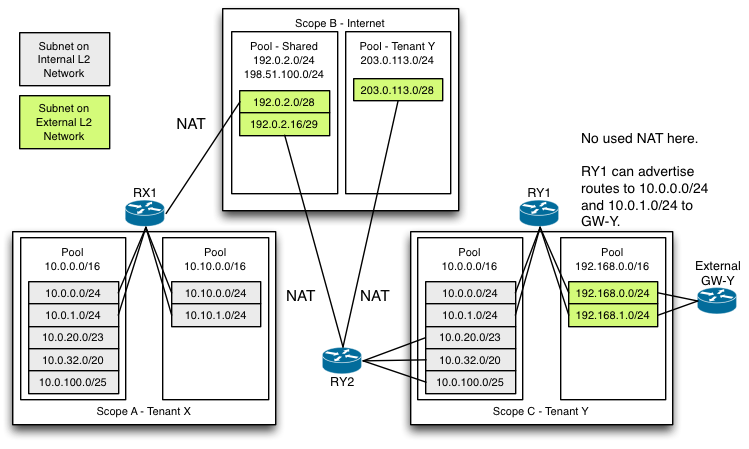

..
 This work is licensed under a Creative Commons Attribution 3.0 Unported
 License.

 http://creativecommons.org/licenses/by/3.0/legalcode

==============
Address Scopes
==============

https://blueprints.launchpad.net/neutron/+spec/address-scopes

Let's make address scopes a first class thing in Neutron.  With all of the
overlapping and arbitrary use of the both IPv4 and IPv6 addresses it is
impossible for Neutron to know what can be routed where.  Address scopes will
be used by Neutron to address this problem.

This proposal has no relation to RFC 4007 IPv6 address scopes [#]_.

.. [#] https://tools.ietf.org/html/rfc4007

Problem Description
===================

Neutron allows tenants to bring their own addresses and allows overlapping IP
addresses on any networks.  Before subnet pools, a subnet could be created with
any cidr the user wanted to supply.  It didn't matter if the address overlapped
with another subnet in the same project or another project.  Neutron provides
isolation at the L2 level to ensure this can work.

Subnet Pools [#]_ added in Kilo are a step in the right direction.  They add
overlap protection and allow an admin to define a pool of addresses from which
subnets can be allocated by multiple projects.  Now we can coordinate
addresses.  This is good.

.. [#] https://blueprints.launchpad.net/neutron/+spec/subnet-allocation

Neutron L3 provides a limited routing solution to isolate between projects.  As
long as routers only connect one project's internal networks, floating ips will
work it out between projects.  This can only go so far.

With IPv6, we want to forget floating IPs and route straight in to tenant
networks.  We can't just turn on routing assuming that everything will just
work.  How can we tell the difference between a valid, unique, and routable
subnet and one that someone just made up while filling out the subnet create
details?  Even with IPv4, some clouds in small to medium size organizations may
want to just dispense with floating IPs and use some private addressing
directly.

Also, a full integration of MPLS/BGP VPN in to Neutron can benefit from this
down the road.  An analog to address scopes in the L3 VPN world are route
distinguishers.  With the addition of address scopes, we can easily map to
route distinguishers.  How address scopes relate to route distinguishers and
the somewhat related route targets is out of scope for this blueprint.  Other
blueprints like this one [#]_ will address this more completely.

.. [#] https://blueprints.launchpad.net/neutron/+spec/prefix-clashing-issue-with-dynamic-routing-protocol

Proposed Change
===============

Add a new object called AddressScope.  An AddressScope can be associated with
multiple SubnetPool objects in a one-to-many relationship.  This will allow
delegating parts of an address scope to different tenants.  The SubnetPools
under an AddressScope must not overlap.  They must also be from the same
address family.  Only an admin can associate an AddressScope and SubnetPool
from different tenants.  Once a subnet pool has been associated, it can only be
updated by the address scope owner.  If this owner is not the subnet pool owner
then it must be an admin.

A SubnetPool which is not associated with an AddressScope will be treated as if
it were alone in its own address scope although no explicit address scope will
be created for it.

In the reference implementation of the L3 plugin, Neutron routers will be aware
of address scopes.  It will use multiple routing tables and policy routing --
features found in Linux and managed by iproute2 -- to implement connecting to
networks with different address scopes.  The incoming device (iif) will be
specified with each rule.

Subnets on a network will be constrained to the same subnet pool [#]_.  Even if
there are multiple pools in a scope, a network will be constrained to only one
pool per address family.  This work has already been completed and backported
to Kilo.

.. [#] https://bugs.launchpad.net/neutron/+bug/1451559

NAT will be automatically included between an internal network and an
"external" network to which a router is connected as a gateway *unless* the two
networks have subnets from subnet pools in the same address scope.  It will
provide 1-1 NAT for floating IPs and many-1 for default SNAT just like today.
This will support existing use cases.  We don't intend to implement any more
NAT use cases than this at this time.  An addition (post-Liberty) may be a more
general ipv4 NAT functionality but we want to gauge the demand for that and
explore other options too, like providing something as part of LBaaS or
something like that.

Routers will route between networks of the same scope without NAT.  For
example, if a tenant has a subnet pool and the admin includes that subnet pool
in the same address scope as the external network then that tenant's subnets
will be routed directly to the external network.

You might be wondering here if a tenant could add any addresses he desires to
the subnet pool after the admin linked it to a scope.  Once a subnet pool has
been associated with an address pool, only the owner of the address scope will
be able to update the pool.

BGP dynamic routing will use the concept of address scopes.  It will attach
metadata in order to know how to advertise routes in the address scopes.  That
will be worked out as part of late work on the BGP spec [#]_.

.. [#] https://review.openstack.org/#/c/125401/

Data Model Impact
-----------------

#. Adds a new table for address scopes.  It will have a name and an id.
#. Adds a new field (default null) to the SubnetPool referencing a single
   AddressScope.  This will be updatable.  On update, the subnet pool will be
   checked for address uniqueness with other subnet pools under the scope.
   Also, routers must be notified of the change in order to adjust routing.

.. TODO Carl Any association with RTs and RDs, etc?  I'm thinking that could be
   developed when dynamic routing is integrated later in Liberty but maybe we
   need to flesh this out here.

REST API Impact
---------------

Basically, we add CRUD semantics for the new address scope object.

We need API to associate address scopes with subnet pools.  This will be done
using a list field on the address scope.  Note that the list will be updated
with overwrite semantics, not patch semantics.  If a subnet pool being added to
the address pool is associated with a different address scope, the operation
will fail.

Only an admin can associate a subnet pool with a different owner than the
address scope.  Once a subnet pool has been associated, only the address scope
owner can update the addresses in the subnet pool.

The subnet pool will be enhanced with a read-only attribute to return the ID of
the address scope to which it belongs.

Security Impact
---------------

See the performance impact.  A change in an address scope could have a big
impact on the control plane.

Notifications Impact
--------------------

Notifications to routers on...

#. Create/Update/Delete of Address Scopes sends an update for routers connected
   to affected subnets.  The scope of any subnet belonging to a subnet pool can
   be changed.
#. RPC data for a router sent to the L3 agent will be enhanced by adding the
   address scope ID of each network a router connects to.

Other End User Impact
---------------------

#. The python-neutron client will be enhanced to operate on address scopes

Performance Impact
------------------

The addition, deletion, or update or AddressScopes could result in a lot of L3
agent activity.  This is because any change in address pools can change the
scope of a subnet.  Any changes involving more than one project will be an
admin only operation which should limit the concern.  In any case, it shouldn't
have any bigger impact than deploying a software upgrade which would restart L3
agents.

When an L3 agent requests information about a router, the address scope of each
of the subnets to which the router is connected must be looked up.  This can be
done without adding any new queries.  Existing queries will need to join
the address scope table on the subnet pool id to retrieve the address scope id.

IPv6 Impact
-----------

This will work for IPv4 and IPv6 equally as well.  Some might think that we
don't need this for IPv6 because everyone will have unique addresses.  But,
they're missing the point because this isn't just about solving the problem of
overlapping IPv4 addresses.  It also recognizes that we have tenants choosing
their own IPv6 addresses too.  They could overlap or not be routable for other
reasons.  We're giving Neutron the ability to know how to handle them.

Other Deployer Impact
---------------------

None

Developer Impact
----------------

None

Community Impact
----------------

The community will love it.  ;)

Seriously though, this allows Neutron L3 to know where stuff can be routed.
This is important especially with IPv6 where we want to just route through to
project's networks instead of using floating IPs to traverse the address scope
boundary.

It is also an important piece to integrating MPLS/VPN which has been requested
countless times from the community.  This work will be integrated with the BGP
work after that work has matured a bit.  BGP and other dynamic routing
protocols will be address scope aware so that only addresses from the right
scope are advertised to a given peer or on a given network.

Alternatives
------------

There are alternatives to using multiple routing tables and policy routing.
For example, iptables rules could be attempted but may not be able to address
all cases, especially if addresses overlap.  Address scopes map very nicely on
to multiple routing tables and routing policy.

There is also work to introduce VRF capability in to the Linux kernel directly
[#]_.  This work could provide richer capability.  However, it is very new and
isn't ready to be used for this purpose.

.. [#] https://lwn.net/Articles/632522/

Implementation
==============

Assignee(s)
-----------

Primary assignee:
  `carl-baldwin <https://launchpad.net/~carl-baldwin>`_

Other contributors:
  `ryan-tidwell <https://launchpad.net/~ryan-tidwell>`_
  `vikschw <https://launchpad.net/~vikschw>`_
  `jbelamaric <https://launchpad.net/~jbelamaric>`_

Work Items
----------

#. Add address scope id to RPC response to L3 agent.  (Initially just the
   subnet pool id)
#. Enhance L3 agent to honor address scopes in routing tables and policy
   routing.  Initially just subnet pool id.  It must be able to handle changing
   scope ids for any given port.
#. Add DB model for address scopes.
#. Add CRUD for AddressScope, including association with SubnetPool.  Update
   the Neutron server to send the appropriate scope instead of the pool.

Dependencies
============

None

Testing
=======

Tempest Tests
-------------

None

Functional Tests
----------------

Functional testing of the L3 agent enhancements to the routing tables.

API Tests
---------

Full API test coverage of the new API.

Documentation Impact
====================

User Documentation
------------------

This feature deserves some new user documentation for how/why to use the new
API.

Developer Documentation
-----------------------

New API to be documented.

References
==========

https://blueprints.launchpad.net/neutron/+spec/subnet-allocation
