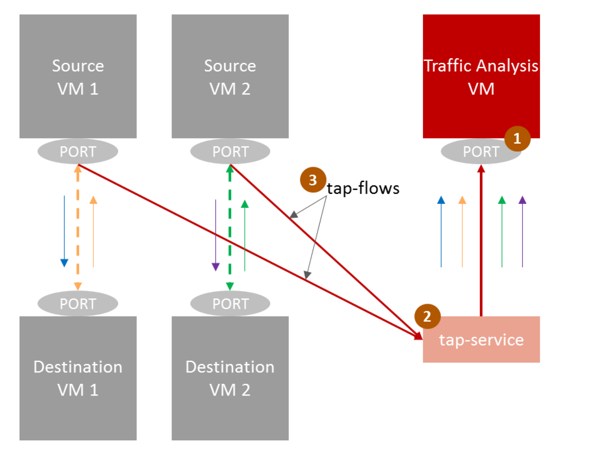

..
 This work is licensed under a Creative Commons Attribution 3.0 Unported
 License.

 http://creativecommons.org/licenses/by/3.0/legalcode

===================================
Port Mirroring API for VF Mirroring
===================================

https://blueprints.launchpad.net/neutron/+spec/port-mirroring-sriov-vf

Port mirroring is a common feature where specific traffic can be mirrored to
a traffic analyzer by configuring rules to identify required flows to be
mirrored and by specifying the analyzer where the traffic is mirrored to.
In addition, mirroring can be configured on VM interfaces to get all the
traffic to and from the interface to the specified analyzer.

A common use case for this feature is a client requesting an analyzer or probe
for traffic that needs to be monitored for a particular VNF using SR-IOV.

This spec will focus on port mirroring based on SR-IOV VF to VF. Currently this
document concentrates on tapping traffic coming in and out of VMs using SR-IOV.
This spec is based on enhancements done by Intel on i40e driver, see [9]_

The current TAPaaS is implemented with OVS ports, see [1]_ and [3]_, this spec
will implement the same for the SR-IOV ports.

Problem Description
===================

In virtual environments there are NICs that have capabilities to send a copy
of network packets seen on one VF port attached to VNF to another VF port
attached to a VM analyzer.

This spec helps leverage the NIC capability to do the mirroring and using Tap as
Service enhancements these features can be configured on hosts and leveraged by
tenants.

The tenant today can use Neutron APIs to create an SRIOV port using provider
network with VLAN 0 and physical network that is used in nova.conf passthrough_whitelist.
This VF will not have any VLAN filters configured on it. See [2]_.
The guest can be configured for multiple VLANs on the same interface. Inside the
guest, sub-interfaces can be configured and can communicate on multiple VLANs.

There are two approaches that can be used for implementing this.

1. The tenant can use the binding_profile value_spec e.g guest_vlans to define
which VLANs will be configured inside guest.

Since the parameter is configured for a VF in the same manner as other PCI
details of a VF, this can be exposed at the same place in the API as other
SRIOV related fields in the binding profile.

Since this spec only describes features available for SRIOV based implementation
and the NIC(i40e) only allows VLAN filter for filtering of the packets that
need to be mirrored on the NIC, this approach is sufficient until we have a
spec for defining multiple VLAN filters for a direct port or on a VF.

This will also help operators to look at VF config at one place in system
rather than running multiple APIs to figure out VFs configuration on host.

2. The second option is to change the TapFlow to include the new field,
vlan_mirror. The TapFlow is the flow classifier for the TapService, so updating
it with the new field will provide the agent with the data it needs to
configure the port.

Use Case I. Mirroring of specific VLANs to VF
---------------------------------------------

This use case will handle sending the mirror packets to tap service for a
specific VLAN configured on the monitored VF. There can be multiple VLANs
configured on the VF.

Proposed Change
===============
Update Tap as a Service to support VF to VF mirroring.

The proposed service will allow the tenants to create a tap service instance
with SR-IOV port to which the user can add Neutron ports that need to be
mirrored by creating tap flows from other SR-IOV port/s.

The user can define various port mirroring flows for the tap service, so one
tap service should be able to handle multiple tap flows.

Use Case I. Mirroring of specific VLANs to VF
---------------------------------------------

This spec will also take care of developing a new driver for Tap for
NicSwitchTapDriver that will perform the sysfs implementation for Intel's
custom i40e driver.

.. image:: ../../images/tapaas-port-mirroring-vfs.png

The VFs will be derived from source port and the probe port attached
to TapService. Example of how a user could mirror traffic based upon
VLANs 2,4,6,18-22 to VF 3 of PF p1p1

# echo add 2,4,6,18-22>/sys/class/net/p1p1/device/sriov/3/vlan_mirror

Example on how a user could remove VLAN 4, 15-17 from traffic mirroring
at destination VF

# echo rem 4,15-17>/sys/class/net/p1p1/device/sriov/3/vlan_mirror

Example on how a user could remove all VLANs from mirroring at VF 3.
# echo rem 0 - 4095>/sys/class/net/p1p1/device/sriov/3/vlan_mirror

The limitation of this mirror is that the vlan/s monitored get traffic in
BOTH direction on probe or service port.

The mirrored packets captured on the VF associated with Tap service will
have vlan tags that are specified in field vlan_filter.

Data Model Impact
-----------------
This approach will change data model for TapFlow object to include new
field vlan_filter.

REST API Impact
---------------
The implementation will be based on option 2. in section Problem description above.
The change will be made to the TapFlow object to add the vlan_filter field in
order for the ports to be able to filter which traffic to mirror. See [4]_
The vlan_filter can be used to monitor a single vlan or a vlan range so
the values can be specified as a string like "171" or "161-164" or "161-164,171".

Tap Agent and Driver Impact
---------------------------
Tap Agent and driver for direct ports will be developed as per usecases above
to configure NIC via sysfs.

Effects on Existing Tap As Service APIs
----------------------------------------
vlan_filter will be added to TapFlow API to filter the traffic that need to be
mirrored.

Command Line Client Impact
--------------------------
Openstack/Neutron client need to be updated to support TAPaaS. See [7]_

Heat support Impact
-------------------

The Tap as service resources do not exist in Openstack. We need to create new
heat resources to support that. See [8]_

Implementation
==============
The Tap As a Service Agents need to add support for SR-IOV ports. Need to
develop a framework to support multiple agents. Also define the taas agent for
sriov ports, taas-sriov-agent. Currently there is agent only for ovs.
As part of the implementation a new driver for Tap as a service will be developed
NicSwitchTapDriver as mentioned above in proposal. See [6]_
Earlier an attempt to keep SRIOV params together was done in implementation by
updating the binding profile, the change was abandoned. See [5]_

Additional work to integrate with Neutron Stadium
-------------------------------------------------

Tempest tests for the new agent and driver.

References
==========

.. [1] `TAP as a Service`:
       https://docs.openstack.org/dragonflow/latest/specs/tap_as_a_service.html

.. [2] `Networking Guide: SR-IOV`:
       https://docs.openstack.org/neutron/queens/admin/config-sriov.html#enable-neutron-sriov-agent-compute

.. [3] `Tap-as-a-service spec`:
       https://review.openstack.org/#/c/256210/

.. [4] `Tap as a Service API REFERENCE`:
       https://github.com/openstack/tap-as-a-service/blob/master/API_REFERENCE.rst

.. [5] `(Old)Implemention of vlan filter for mirroring by changing binding profile in neutron port`:
       https://review.openstack.org/#/c/594310/

.. [6] `Implementation of vlan filter for mirroing by adding vlan mirror filter to TapFlow`:
       https://review.openstack.org/#/c/603501/

.. [7] `Heat resources for Tap as Service`:
       https://review.openstack.org/#/c/591523/

.. [8] `Openstack Client update for support of Tap as Service vlan filter`
       https://review.openstack.org/#/c/589253/

.. [9] Intel enhanced i40e driver for support of vlan mirror filtering.
       https://sourceforge.net/projects/e1000/files/i40e%20stable/2.7.12/
