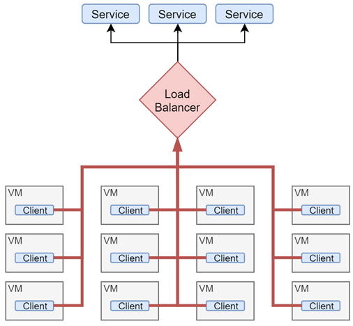
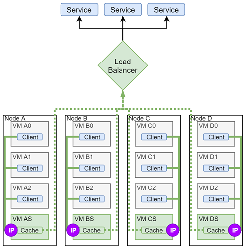

..
 This work is licensed under a Creative Commons Attribution 3.0 Unported
 License.

 http://creativecommons.org/licenses/by/3.0/legalcode

========================================
Node-Local virtual IP address (Local IP)
========================================

RFE: https://bugs.launchpad.net/neutron/+bug/1930200

This spec proposes a new type of shared virtual IP address that can be used to
access distributed and/or multi-node services and applications running in the
cloud. The feature is primarily focused on high efficiency and performance of
the networking data plane for very large scale clouds and/or clouds with high
network throughput demands.

Problem Description
===================

In a topology where several workloads access a shared resource over network
obvious bottlenecks are the network and the shared resource itself
(or a loadbalancer):

Proposed feature suggests to solve this bottleneck issue by deploying local
replicas/caches of the shared service and re-translating local workloads`
requests to these replicas transparently. Transparency is achieved by
assigning same IP address to local replicas as on main shared resource.

Primary use-cases for this feature are listed in the RFE description. While
the proposed virtual IP may be used on its own for simple use cases, it is
mainly intended to serve as a basic building block and should be used in
conjunction with other services to provide full-fledged service discovery,
load balancing, proxying and other advanced features.

Proposed Change
===============

Add a new Node Local IP (or just Local IP) resource - a virtual IP that can be
shared across multiple ports/VMs (similar to anycast IP) and is guaranteed
to only be reachable within the same physical server/node boundaries.
The mechanism is similar to Floating IP, with the difference that Local IP
could be assigned to several fixed IPs (on different nodes) simultaneously and
that all address translation happens early/locally on the node's integration
bridge.

The scope of this feature is limited to:

* API and CLI to provide fine grained control over allocation and assignment
  of the Local IP addresses

* Networking data plane mechanism to efficiently redirect traffic to a port
  within the same physical node (if present) or to optionally forward it to a
  fallback destination

* Local IP will only be accessible within the same L2 segment

Local IP object will be composed of the following objects & attributes:

* Underlying Neutron port representing Local IP

* Collection of associated Neutron ports that will serve as packets'
  destination when the packet source port is located on the same physical node

* IP mode for local ports:

  * 'translate' (default) - Local IP will behave as DNAT for redirected packets

  * 'passthrough' - packets will be redirected without modification to IP
    headers; destination VM's guest OS will be responsible for configuring
    Local IP's IP address on a corresponding port interface. This is similar
    to current allowed address pair mechanism with the benefit of fine grained
    control over IP allocation and assignment

* Fallback policy:

  * 'forward' (default) - to redirect packets to an underlying Neutron port IP
    address if no Local IP assigned port is available on the physical node

  * 'drop' - packets will be dropped if no Local IP assigned port is available
    on the physical node - out of scope for now

  * 'reject' - similar to iptables' 'reject' policy to help clients fail fast
    if no Local IP assigned port is available on the physical node -
    out of scope for now

REST API Impact
---------------

New Local IP API resource
~~~~~~~~~~~~~~~~~~~~~~~~~

+-------------------+---------+-------+------+---------------------------------------+
| Attribute         | Type    | Req   | CRUD | Description                           |
+===================+=========+=======+======+=======================================+
| id                | uuid-str| Yes   | R    | Unique identifier for the             |
|                   |         |       |      | Local IP object.                      |
+-------------------+---------+-------+------+---------------------------------------+
| name              | String  | No    | CRU  | Human readable name for the Local IP  |
|                   |         |       |      | (255 characters limit). Does not have |
|                   |         |       |      | to be unique.                         |
+-------------------+---------+-------+------+---------------------------------------+
| description       | String  | No    | CRU  | Human readable description for the    |
|                   |         |       |      | Local IP (255 characters limit).      |
+-------------------+---------+-------+------+---------------------------------------+
| project_id        | uuid-str| No    | CR   | Owner of the Local IP.                |
+-------------------+---------+-------+------+---------------------------------------+
| local_ip          | String  | No    | CR   | Local IP CIDR (virtual) that will be  |
|                   |         |       |      | reachable within the same physical    |
|                   |         |       |      | server/node. Required when provided   |
|                   |         |       |      | local_port_id's Port has several fixed|
|                   |         |       |      | IPs                                   |
+-------------------+---------+-------+------+---------------------------------------+
| local_port_id     | uuid-str| Yes   | CR   | Underlying (backup) Neutron port ID   |
|                   |         |       |      | used by Local IP object to get actual |
|                   |         |       |      | IP address for local translation.     |
|                   |         |       |      | If port has several fixed IPs -       |
|                   |         |       |      | local_ip should be provided as well.  |
+-------------------+---------+-------+------+---------------------------------------+
| network_id        | uuid-str| Yes   | CR   | ID of network from which to allocate  |
|                   |         |       |      | Local IPs underlying Neutron port.    |
|                   |         |       |      | Required when no local_port_id        |
|                   |         |       |      | was provided upon creation.           |
+-------------------+---------+-------+------+---------------------------------------+
| ip_mode           | String  | No    | CRU  | One of 'translate' (for DNAT) or      |
|                   |         |       |      | 'passthrough' (no NAT) modes described|
|                   |         |       |      | above. Default: 'translate'           |
+-------------------+---------+-------+------+---------------------------------------+

|

New Local IP Association API resource
~~~~~~~~~~~~~~~~~~~~~~~~~~~~~~~~~~~~~~

+-------------------+---------+-------+------+---------------------------------------+
| Attribute         | Type    | Req   | CRUD | Description                           |
+===================+=========+=======+======+=======================================+
| local_ip_id       | uuid-str| Yes   | CR   | Local IP id                           |
+-------------------+---------+-------+------+---------------------------------------+
| fixed_port_id     | uuid-str| Yes   | CR   | ID of associated Neutron fixed port   |
+-------------------+---------+-------+------+---------------------------------------+
| fixed_ip          | String  | No    | CR   | Exact port's fixed IP address that is |
|                   |         |       |      | associated with Local IP              |
+-------------------+---------+-------+------+---------------------------------------+
| host              | List    | No    | R    | Host where associated port is bound   |
+-------------------+---------+-------+------+---------------------------------------+

|

Basically new API will be similar to existing Floating IP API with some
differences:

* Local IP could be associated with multiple fixed ports at the same time.

* Local IP may be created by providing an existing Neutron port which will
  be used to obtain the IP address and may serve as a fallback destination

* Creating Local IP without explicitly specified port will trigger creation
  of an underlying Neutron port to handle IPAM, network boundaries and
  permission checks. In this case network ID should be specified upon
  creation

* Deletion of the Local IP underlying fallback port will be prohibited by
  the Neutron server as long as a Local IP associated with such port exists

* Manual underlying Neutron port updates will be ignored by parent Local IP
  (similar to current Floating IP behavior)

* Deleting Local IP should be prohibited if Local IP has associated local
  ports; 'force' option may be provided to trigger local port disassociation
  on deletion; deleting Local IP should also delete the underlying Neutron
  port representing Local IP if this port was created specifically for
  Local IP and did not exist before

* IPAM and IP validation will be handled automatically by underlying Port

* Local IP will behave similar to Port and Floating IP API in terms of
  user/admin access rights

* Local IP may have quotas similar to Floating IP API (out of scope for now)

Data Model Impact
-----------------

The following are the backend database tables for the REST API proposed above.

|
| **Local IPs**

+-------------------+---------+-------+---------------------------------------+
| Attribute         | Type    | Req   | Description                           |
+===================+=========+=======+=======================================+
| id (PK)           | uuid-str| Yes   | Unique identifier for the             |
|                   |         |       | Local IP object.                      |
+-------------------+---------+-------+---------------------------------------+
| name              | string  | No    | Human readable name for the Local IP  |
|                   |         |       | (255 characters limit). Does not have |
|                   |         |       | to be unique.                         |
+-------------------+---------+-------+---------------------------------------+
| project_id        | uuid-str| No    | Owner of the Local IP. Only admin     |
|                   |         |       | users can specify a project identifier|
|                   |         |       | other than their own.                 |
+-------------------+---------+-------+---------------------------------------+
| local_ip          | string  | Yes   | Local IP CIDR (virtual) that will be  |
|                   |         |       | reachable within the same physical    |
|                   |         |       | server/node.                          |
+-------------------+---------+-------+---------------------------------------+
| local_port_id (FK)| uuid-str| Yes   | Underlying (backup) Neutron port ID   |
|                   |         |       | used by Local IP object to get actual |
|                   |         |       | IP address for local NATting          |
+-------------------+---------+-------+---------------------------------------+
| ip_mode           | string  | No    | One of 'translate' (for DNAT) or      |
|                   |         |       | 'passthrough' (no NAT) modes described|
|                   |         |       | above. Default: 'translate'           |
+-------------------+---------+-------+---------------------------------------+

|
| **Local IP associations**

+-------------------+---------+-------+----------------------------------------+
| Attribute         | Type    | Req   | Description                            |
+===================+=========+=======+========================================+
| local_ip_id (PK)  | uuid-str| Yes   | UUID of a Local IP                     |
+-------------------+---------+-------+----------------------------------------+
| fixed_port_id (PK)| uuid-str| Yes   | UUID of a port which will serve Local  |
|                   |         |       | IP requests on this port's host        |
+-------------------+---------+-------+----------------------------------------+
| fixed_ip          | String  | Yes   | Exact port's fixed IP address that is  |
|                   |         |       | associated with Local IP               |
+-------------------+---------+-------+----------------------------------------+

Client impact
-------------

* New CLI and OpenStack client commands to create, update, delete, list and
  show Local IPs and to associate/disassociate fixed IP ports

OVS, ML2 Drivers impact
-----------------------

RPC interface between server and OVS agent will be updated to include info
about Local IPs associated with agent's ports. Server will update port_details
with this info.

OVS agent will perform following flow updates based on Local IPs info:

* update ARP spoofing flow for associated port
  (like done for allowed address pairs)
* identify network/local vlan of associated port
* for each port from this network - redirect packets from table 0 or
  24(ARP_SPOOF)/25(MAC_SPOOF) to a new table - 50 (LOCAL_EGRESS)

Below flow examples are for the case when fixed port (id=56fbc1e7-2c..,
MAC=fa:16:3e:9a:1a:de, IP=10.0.0.51) is associated with Local IP 10.0.0.10

::

  table=25, n_packets=0, n_bytes=0, priority=2,in_port="tap56fbc1e7-2c",
  dl_src=fa:16:3e:9a:1a:de actions=resubmit(,50)

* table 50(LOCAL_EGRESS) serves for memorizing local vlans to later
  distinguish Local IP traffic from different nets and redirect packets further
  to table 51(LOCAL_IP_HANDLE)

::

  table=50, n_packets=0, n_bytes=0, priority=9,in_port="tap56fbc1e7-2c"
  actions=load:0x4->NXM_NX_REG6[],resubmit(,51)

* table 51(LOCAL_IP_HANDLE) has actual flows for Local IP handling

  * ARP responder flow to handle Local IP ARP requests from same subnet ports
    (fixed port and local IP associated with it are from the same IP subnet)

    ::

      table=51, n_packets=0, n_bytes=0, priority=1,arp,reg6=0x4,
      arp_tpa=10.0.0.10
      actions=load:0x2->NXM_OF_ARP_OP[],
      move:NXM_NX_ARP_SHA[]->NXM_NX_ARP_THA[],
      move:NXM_OF_ARP_SPA[]->NXM_OF_ARP_TPA[],
      load:0xfa163e9a1ade->NXM_NX_ARP_SHA[],
      load:0x1010102->NXM_OF_ARP_SPA[],
      move:NXM_OF_ETH_SRC[]->NXM_OF_ETH_DST[],
      mod_dl_src:fa:16:3e:9a:1a:de,IN_PORT

  * NAT flows to do actual Local IP address translation

    ::

      table=51, n_packets=0, n_bytes=0, priority=10,ip,reg6=0x4,
      nw_dst=10.0.0.10
      actions=ct(commit,table=60,zone=4,nat(dst=10.0.0.51))

      table=51, n_packets=0, n_bytes=0, priority=10,ct_state=-trk,ip,reg6=0x4,
      dl_src=fa:16:3e:9a:1a:de,nw_src=10.0.0.51 actions=ct(table=60,zone=4,nat)

    After translation packets are resubmitted further to TRANSIENT_TABLE (60)

    Alternatively static NAT could be used to avoid kernel conntrack:
    learn back flows with 7 tuple (src_mac, dest_mac, src_ip, dest_ip,
    protocol, src_protocol_port, dest_protocol_port)

    ::

      table=51, priority=30,tcp,dl_vlan=1,dl_dst=fa:16:3e:9a:1a:de,
      dl_src=fa:16:3e:4f:26:fd,nw_src=10.0.0.100,nw_dst=10.0.0.10,
      tp_dst=0x8000/0x8000
      actions=learn(table=62,idle_timeout=30,hard_timeout=1800,priority=90,
      eth_type=0x800,nw_proto=6,NXM_OF_ETH_SRC[]=NXM_OF_ETH_DST[],
      NXM_OF_ETH_DST[]=NXM_OF_ETH_SRC[],NXM_OF_IP_SRC[]=NXM_OF_IP_DST[],
      NXM_OF_IP_DST[]=NXM_OF_IP_SRC[],NXM_OF_TCP_DST[]=NXM_OF_TCP_SRC[],
      NXM_OF_TCP_SRC[]=NXM_OF_TCP_DST[],NXM_OF_VLAN_TCI[0..11],
      load:NXM_NX_REG0[0..11]->NXM_OF_VLAN_TCI[0..11],
      output:NXM_OF_IN_PORT[]),set_field:10.0.0.10->ip_dst,goto_table:60

    This is usable in case of OVS offloading (e.g. SmartNICs).
    This will be made configurable on the ovs agent side.

  * Not matched (not related to Local IP) packets are transmitted further

    ::

      table=51, n_packets=0, n_bytes=0, priority=0 actions=resubmit(,60)

Packet processing example:

  ::

    VM1 <10.0.0.100> tries to access Local IP 10.0.0.10
    Local IP is assigned to port with MAC_2/10.0.0.51:

    ARP:
    VM1 -> ARP -> 10.0.0.10 and response <10.0.0.10 has MAC_2>

    Egress:
    <VM1_MAC_1 + 10.0.0.100> to <MAC_2 + 10.0.0.10>
    <<ct NAT>>
    <VM1_MAC_1 + 10.0.0.100> to <MAC_2 + 10.0.0.51>

    Ingress (back):
    <MAC_2 + 10.0.0.51> to <VM1_MAC_1 + 10.0.0.100>
    <<ct NAT>>
    <MAC_2 + 10.0.0.10> to <VM1_MAC_1 + 10.0.0.100>

Scheduling
----------

Local IP will have no effect on VM scheduling/placement. Local IP operates
under assumption that at any given time any physical node in the cloud should
have no more than one active port/VM associated with a given Local IP.
Users are responsible to utilize OpenStack placement/scheduling features (e.g.
anti-affinity rules) to avoid assigning multiple ports from the same physical
node the the same Local IP.

However there might be valid cases when multiple Local IP's local ports may be
colocated on the same physycal node (e.g. as a result of temporary live
migration during other node's maintenance). Local IP should provide a
deterministic way of handling such situations (e.g. in case of multiple local
ports, only the oldest port shall be used).

Initial release limitations
---------------------------

* Only IPv4 will be supported. IPv6 support will be considered in future
  releases

* Only 'openvswitch' ML2 mechanism driver will support the feature

* Only tunnel (VxLAN, GRE) networks will be supported. 'vlan' will be
  considered if require minimum overhead

* No deterministic handling of packets if a node contains multiple local ports
  from same L2 segment associated with the same Local IP

* no 'reject' and 'drop' fallback policies; only 'forward' will be supported

References
==========

